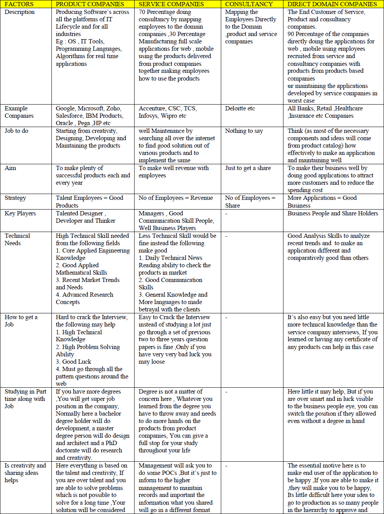
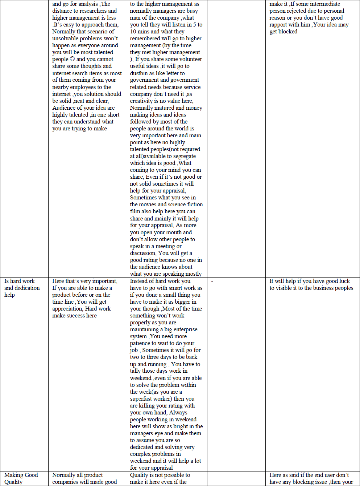
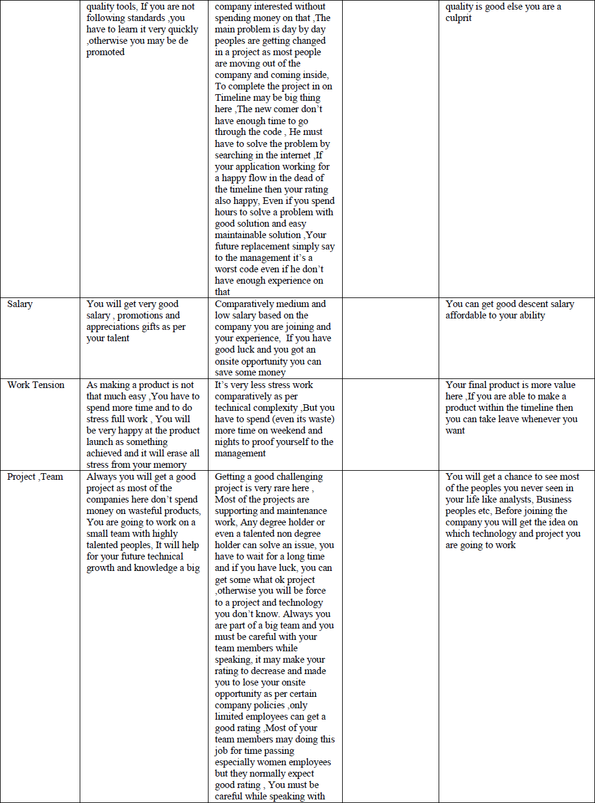
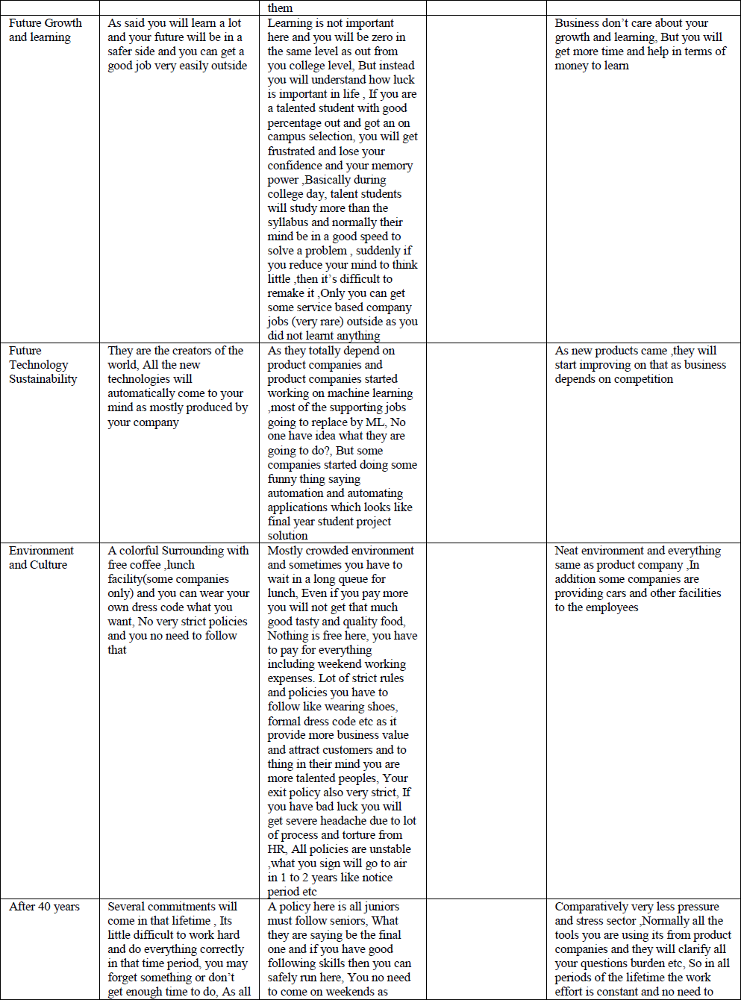
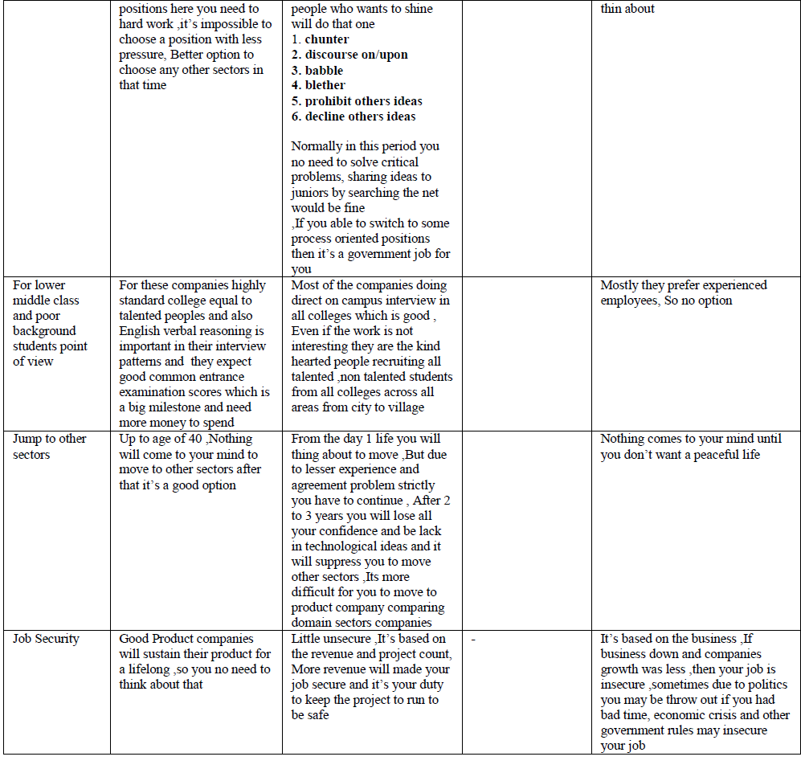

# Product-Companies-vs-Service-Companies-for-Freshers
Just a comparison table for product vs service companies for freshers, Put it in github as its the source of origin to start a code similar to source of origin for the employees to start the life

